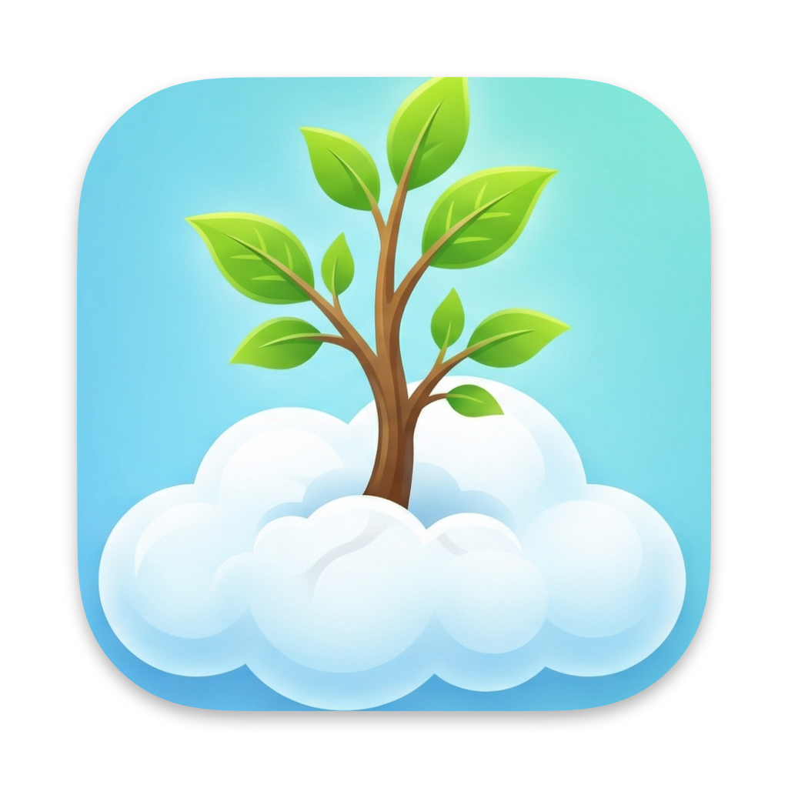

<p align="center">
  
</p>

<h1 align="center">AloeAgent</h1>

<p align="center">
  A personal AI agent running on <a href="https://developers.cloudflare.com/sandbox/">Cloudflare Sandbox</a>.<br/>
  Built on <a href="https://github.com/openclaw/openclaw">OpenClaw</a> and powered by <a href="https://www.cloudflare.com/">Cloudflare Workers</a>.
</p>

> **Experimental:** This is a proof of concept. It is not officially supported and may break without notice. Use at your own risk.

[](https://deploy.workers.cloudflare.com/?url=https://github.com/aloewright/agent)

---

## Table of Contents

- [Requirements](#requirements)
- [Container Cost Estimate](#container-cost-estimate)
- [What is AloeAgent?](#what-is-aloeagent)
- [Architecture](#architecture)
- [Quick Start](#quick-start)
- [Development](#development)
- [Setting Up the Admin UI](#setting-up-the-admin-ui)
- [Authentication](#authentication)
  - [Device Pairing](#device-pairing)
  - [Gateway Token](#gateway-token-required)
- [Persistent Storage (R2)](#persistent-storage-r2)
- [Container Lifecycle](#container-lifecycle)
- [Admin UI](#admin-ui)
- [Debug Endpoints](#debug-endpoints)
- [Optional: Chat Channels](#optional-chat-channels)
- [Optional: Browser Automation (CDP)](#optional-browser-automation-cdp)
- [Built-in Skills](#built-in-skills)
- [Optional: Cloudflare AI Gateway](#optional-cloudflare-ai-gateway)
- [All Secrets Reference](#all-secrets-reference)
- [Security Considerations](#security-considerations)
- [Troubleshooting](#troubleshooting)
- [Known Issues](#known-issues)
- [Credits](#credits)
- [Links](#links)

---

## Requirements

- [Workers Paid plan](https://www.cloudflare.com/plans/developer-platform/) ($5 USD/month) -- required for Cloudflare Sandbox containers. Running the container incurs additional compute costs; see [Container Cost Estimate](#container-cost-estimate) below for details.
- [Anthropic API key](https://console.anthropic.com/) -- for Claude access, or you can use AI Gateway's [Unified Billing](https://developers.cloudflare.com/ai-gateway/features/unified-billing/)

The following Cloudflare features used by this project have free tiers:
- Cloudflare Access (authentication)
- Browser Rendering (for browser navigation)
- AI Gateway (optional, for API routing/analytics)
- R2 Storage (optional, for persistence)

## Container Cost Estimate

This project uses a `standard-4` Cloudflare Container instance. Below are approximate monthly costs assuming the container runs 24/7, based on [Cloudflare Containers pricing](https://developers.cloudflare.com/containers/pricing/):

| Resource | Provisioned | Monthly Usage | Included Free | Overage | Approx. Cost |
|----------|-------------|---------------|---------------|---------|--------------|
| Memory | 4 GiB | 2,920 GiB-hrs | 25 GiB-hrs | 2,895 GiB-hrs | ~$26/mo |
| CPU (at ~10% utilization) | 1/2 vCPU | ~2,190 vCPU-min | 375 vCPU-min | ~1,815 vCPU-min | ~$2/mo |
| Disk | 8 GB | 5,840 GB-hrs | 200 GB-hrs | 5,640 GB-hrs | ~$1.50/mo |
| Workers Paid plan | | | | | $5/mo |
| **Total** | | | | | **~$34.50/mo** |

Notes:
- CPU is billed on **active usage only**, not provisioned capacity. The 10% utilization estimate is a rough baseline for a lightly-used personal assistant; your actual cost will vary with usage.
- Memory and disk are billed on **provisioned capacity** for the full time the container is running.
- To reduce costs, configure `SANDBOX_SLEEP_AFTER` (e.g., `10m`) so the container sleeps when idle. A container that only runs 4 hours/day would cost roughly ~$5-6/mo in compute on top of the $5 plan fee.
- Network egress, Workers/Durable Objects requests, and logs are additional but typically minimal for personal use.
- See the [instance types table](https://developers.cloudflare.com/containers/pricing/) for other options (e.g., `lite` at 256 MiB/$0.50/mo memory or `standard-4` at 12 GiB for heavier workloads).

## What is AloeAgent?

AloeAgent is a personal AI agent that runs in a [Cloudflare Sandbox](https://developers.cloudflare.com/sandbox/) container, providing a fully managed, always-on deployment without needing to self-host.

It is built on top of [OpenClaw](https://github.com/openclaw/openclaw) (formerly Clawdbot), an open-source personal AI assistant with a gateway architecture. Key features:

- **Admin UI** -- Web-based management dashboard at `/_admin/`
- **Swarm Terminal** -- Launch Claude Code, Codex, Gemini, or shell sessions directly in the browser
- **Multi-channel support** -- Telegram, Discord, Slack
- **Device pairing** -- Secure DM authentication requiring explicit approval
- **Persistent conversations** -- Chat history and context across sessions via R2 storage
- **Agent runtime** -- Extensible AI capabilities with workspace and skills
- **Browser automation** -- Chrome DevTools Protocol (CDP) shim for web scraping and screenshots
- **AI Gateway integration** -- Route requests through Cloudflare AI Gateway for caching, rate limiting, and analytics
- **better-auth support** -- Optional `cloudos-auth` service binding for session-based authentication

Optional R2 storage enables persistence across container restarts.

## Architecture

```
                        +---------------------+
                        |    Client Devices    |
                        | Browser / CLI / Chat |
                        +---------+-----------+
                                  |
                        HTTPS / WSS + Token
                                  |
                    +-------------v--------------+
                    |   Cloudflare Access / Auth  |
                    |  (JWT or better-auth cookie)|
                    +-------------+--------------+
                                  |
              +-------------------v--------------------+
              |         Cloudflare Worker (Hono)        |
              |                                         |
              |  +------------+  +------------------+   |
              |  | Public     |  | Admin API        |   |
              |  | Routes     |  | /api/admin/*     |   |
              |  | /login     |  | devices, storage |   |
              |  | /api/status|  | gateway restart  |   |
              |  +------------+  +------------------+   |
              |                                         |
              |  +------------+  +------------------+   |
              |  | Admin UI   |  | CDP Shim         |   |
              |  | /_admin/*  |  | /cdp/*           |   |
              |  | React SPA  |  | Browser Rendering|   |
              |  +------------+  +------------------+   |
              +-------------------+---------------------+
                                  |
                    +-------------v--------------+
                    |  Durable Object (Sandbox)  |
                    +----------------------------+
                    |                            |
                    |  +----------------------+  |
                    |  | Container (Docker)    |  |
                    |  |                       |  |
                    |  | OpenClaw Gateway      |  |
                    |  |   :18789              |  |
                    |  |                       |  |
                    |  | Claude Code / Codex   |  |
                    |  | Gemini CLI / Shell    |  |
                    |  |                       |  |
                    |  | Skills & Agents       |  |
                    |  +----------------------+  |
                    |                            |
                    +-------------+--------------+
                                  |
                  +---------------+---------------+
                  |               |               |
            +-----v-----+  +-----v-----+  +------v------+
            | R2 Bucket  |  | KV Store  |  | AI Gateway  |
            | Persistent |  | Swarm     |  | or direct   |
            | Storage    |  | Memory    |  | Anthropic/  |
            +------------+  +-----------+  | OpenAI API  |
                                           +-------------+
```


## Quick Start

_Cloudflare Sandboxes are available on the [Workers Paid plan](https://dash.cloudflare.com/?to=/:account/workers/plans)._

### 1. Clone and install

```bash
git clone https://github.com/aloewright/agent.git
cd agent
npm install
```

### 2. Configure secrets

You need at least one AI provider key and a gateway token:

```bash
# Option A: Direct Anthropic API key
npx wrangler secret put ANTHROPIC_API_KEY

# Option B: Cloudflare AI Gateway (see "Optional: Cloudflare AI Gateway" below)
# npx wrangler secret put CLOUDFLARE_AI_GATEWAY_API_KEY
# npx wrangler secret put CF_AI_GATEWAY_ACCOUNT_ID
# npx wrangler secret put CF_AI_GATEWAY_GATEWAY_ID

# Generate and set a gateway token (required for remote access)
export OPENCLAW_GATEWAY_TOKEN=$(openssl rand -hex 32)
echo "Your gateway token: $OPENCLAW_GATEWAY_TOKEN"
echo "$OPENCLAW_GATEWAY_TOKEN" | npx wrangler secret put OPENCLAW_GATEWAY_TOKEN
```

### 3. Deploy

```bash
npm run deploy
```

This builds the admin UI with Vite and deploys the Worker + container to Cloudflare.

### 4. Open the Control UI

```
https://your-worker.workers.dev/?token=YOUR_GATEWAY_TOKEN
```

Replace `your-worker` with your actual worker subdomain. The first request may take 1-2 minutes while the container starts.

> **Important:** You will not be able to use the Control UI until you:
> 1. [Set up Cloudflare Access](#setting-up-the-admin-ui) to protect the admin UI
> 2. [Pair your device](#device-pairing) via the admin UI at `/_admin/`

You'll also likely want to [enable R2 storage](#persistent-storage-r2) so your paired devices and conversation history persist across container restarts (optional but recommended).

## Development

### Local dev server

```bash
# Create .dev.vars for local development
cat > .dev.vars << 'EOF'
DEV_MODE=true
DEBUG_ROUTES=true
EOF

# Start the dev server (Worker + Vite HMR)
npm run dev
```

`DEV_MODE=true` skips Cloudflare Access authentication and device pairing so you can develop locally without configuring secrets.

### Available scripts

| Script | Description |
|--------|-------------|
| `npm run dev` | Start Vite dev server with HMR |
| `npm start` | Start with `wrangler dev` (Worker runtime) |
| `npm run build` | Build the admin UI with Vite |
| `npm run deploy` | Build + deploy to Cloudflare |
| `npm run typecheck` | Run TypeScript type checking |
| `npm run lint` | Lint with oxlint |
| `npm run lint:fix` | Lint and auto-fix |
| `npm test` | Run unit tests (Vitest) |
| `npm run test:watch` | Run tests in watch mode |
| `npm run test:coverage` | Run tests with coverage |
| `npm run test:e2e` | Run Playwright E2E tests |

### Project structure

```
src/
  index.ts          # Worker entry point (Hono)
  routes/
    public.ts       # Public routes (health, login, assets)
    api.ts          # Admin API routes (devices, storage, gateway)
  gateway/
    process.ts      # Sandbox process management
    env.ts          # Environment variable builder
    r2.ts           # R2/rclone configuration
    sync.ts         # R2 sync operations
  auth/
    middleware.ts   # CF Access + better-auth middleware
  client/
    App.tsx         # Admin UI React app
    pages/          # Admin UI pages (Terminal, etc.)
  types.ts          # Shared type definitions
  config.ts         # Constants (ports, timeouts)
Dockerfile          # Sandbox container image
start-openclaw.sh   # Container startup script
skills/             # Built-in agent skills
wrangler.jsonc      # Cloudflare Worker configuration
```

### Secrets management with Doppler (optional)

If you use [Doppler](https://www.doppler.com/) for secrets management:

```bash
# Sync Doppler secrets to Wrangler
npm run secrets:sync

# Deploy with Doppler-injected env vars
npm run deploy:doppler

# Dev with Doppler
npm run start:doppler
```

## Setting Up the Admin UI

To use the admin UI at `/_admin/` for device management, you need to:
1. Enable Cloudflare Access on your worker
2. Set the Access secrets so the worker can validate JWTs

### 1. Enable Cloudflare Access on workers.dev

The easiest way to protect your worker is using the built-in Cloudflare Access integration for workers.dev:

1. Go to the [Workers & Pages dashboard](https://dash.cloudflare.com/?to=/:account/workers-and-pages)
2. Select your Worker
3. In **Settings**, under **Domains & Routes**, in the `workers.dev` row, click the meatballs menu (`...`)
4. Click **Enable Cloudflare Access**
5. Copy the values shown in the dialog (you'll need the AUD tag later). **Note:** The "Manage Cloudflare Access" link in the dialog may 404 -- ignore it.
6. To configure who can access, go to **Zero Trust** in the Cloudflare dashboard sidebar -> **Access** -> **Applications**, and find your worker's application:
   - Add your email address to the allow list
   - Or configure other identity providers (Google, GitHub, etc.)
7. Copy the **Application Audience (AUD)** tag from the Access application settings. This will be your `CF_ACCESS_AUD` in Step 2 below

### 2. Set Access Secrets

After enabling Cloudflare Access, set the secrets so the worker can validate JWTs. You can use either the CLI or the Cloudflare dashboard:

**Option A: CLI**

```bash
# Your Cloudflare Access team domain (e.g., "myteam.cloudflareaccess.com")
npx wrangler secret put CF_ACCESS_TEAM_DOMAIN

# The Application Audience (AUD) tag from your Access application that you copied in the step above
npx wrangler secret put CF_ACCESS_AUD
```

**Option B: Dashboard**

Go to **Workers & Pages** -> your worker -> **Settings** -> **Variables and Secrets** and add both `CF_ACCESS_TEAM_DOMAIN` and `CF_ACCESS_AUD`. Secrets added through the dashboard take effect on the next request without redeployment.

You can find your team domain in the [Zero Trust Dashboard](https://one.dash.cloudflare.com/) under **Settings** > **Custom Pages** (it's the subdomain before `.cloudflareaccess.com`).

### 3. Redeploy

```bash
npm run deploy
```

Now visit `/_admin/` and you'll be prompted to authenticate via Cloudflare Access before accessing the admin UI.

### Alternative: Manual Access Application

If you prefer more control, you can manually create an Access application:

1. Go to [Cloudflare Zero Trust Dashboard](https://one.dash.cloudflare.com/)
2. Navigate to **Access** > **Applications**
3. Create a new **Self-hosted** application
4. Set the application domain to your Worker URL
5. Add paths to protect: `/_admin/*`, `/api/*`, `/debug/*`
6. Configure your desired identity providers (e.g., email OTP, Google, GitHub)
7. Copy the **Application Audience (AUD)** tag and set the secrets as shown above

### Alternative: better-auth (cloudos-auth)

AloeAgent supports session-based authentication via a `cloudos-auth` service binding as an alternative to Cloudflare Access. When `AUTH_SERVICE` is configured in `wrangler.jsonc`, AloeAgent will use better-auth's cookie-based sessions (`better-auth.session_token`) instead of JWT validation. The cookie is set on `.pdx.software` domain for cross-subdomain sharing. See the service bindings section in `wrangler.jsonc`.

### Local Development

For local development, create a `.dev.vars` file with:

```bash
DEV_MODE=true               # Skip Cloudflare Access auth + bypass device pairing
DEBUG_ROUTES=true           # Enable /debug/* routes (optional)
```

## Authentication

By default, AloeAgent uses **device pairing** for authentication. When a new device (browser, CLI, etc.) connects, it must be approved via the admin UI at `/_admin/`.

### Device Pairing

1. A device connects to the gateway
2. The connection is held pending until approved
3. An admin approves the device via `/_admin/`
4. The device is now paired and can connect freely

This is the most secure option as it requires explicit approval for each device.

### Gateway Token (Required)

A gateway token is required to access the Control UI when hosted remotely. Pass it as a query parameter:

```
https://your-worker.workers.dev/?token=YOUR_TOKEN
wss://your-worker.workers.dev/ws?token=YOUR_TOKEN
```

**Note:** Even with a valid token, new devices still require approval via the admin UI at `/_admin/` (see Device Pairing above).

For local development only, set `DEV_MODE=true` in `.dev.vars` to skip Cloudflare Access authentication and enable `allowInsecureAuth` (bypasses device pairing entirely).

## Persistent Storage (R2)

By default, data (configs, paired devices, conversation history) is lost when the container restarts. To enable persistent storage across sessions, configure R2:

### 1. Create R2 API Token

1. Go to **R2** > **Overview** in the [Cloudflare Dashboard](https://dash.cloudflare.com/)
2. Click **Manage R2 API Tokens**
3. Create a new token with **Object Read & Write** permissions
4. Select the `moltbot-data` bucket (created automatically on first deploy)
5. Copy the **Access Key ID** and **Secret Access Key**

### 2. Set Secrets

```bash
# R2 Access Key ID
npx wrangler secret put R2_ACCESS_KEY_ID

# R2 Secret Access Key
npx wrangler secret put R2_SECRET_ACCESS_KEY

# Your Cloudflare Account ID
npx wrangler secret put CF_ACCOUNT_ID
```

To find your Account ID: Go to the [Cloudflare Dashboard](https://dash.cloudflare.com/), click the three dots menu next to your account name, and select "Copy Account ID".

### How It Works

R2 storage uses a backup/restore approach for simplicity:

**On container startup:**
- If R2 is mounted and contains backup data, it's restored to the config directory
- The agent uses its default paths (no special configuration needed)

**During operation:**
- A cron job runs every 5 minutes to sync the config to R2
- You can also trigger a manual backup from the admin UI at `/_admin/`

**In the admin UI:**
- When R2 is configured, you'll see "Last backup: [timestamp]"
- Click "Backup Now" to trigger an immediate sync

Without R2 credentials, the agent still works but uses ephemeral storage (data lost on container restart).

## Container Lifecycle

By default, the sandbox container stays alive indefinitely (`SANDBOX_SLEEP_AFTER=never`). This is recommended because cold starts take 1-2 minutes.

To reduce costs for infrequently used deployments, you can configure the container to sleep after a period of inactivity:

```bash
npx wrangler secret put SANDBOX_SLEEP_AFTER
# Enter: 10m (or 1h, 30m, etc.)
```

When the container sleeps, the next request will trigger a cold start. If you have R2 storage configured, your paired devices and data will persist across restarts.

## Admin UI


Access the admin UI at `/_admin/` to:
- **R2 Storage Status** -- Shows if R2 is configured, last backup time, and a "Backup Now" button
- **Restart Gateway** -- Kill and restart the gateway process
- **Device Pairing** -- View pending requests, approve devices individually or all at once, view paired devices
- **Swarm Terminal** -- Launch Claude Code, Codex, Gemini, or shell sessions in the browser

The admin UI requires Cloudflare Access authentication (or `DEV_MODE=true` for local development).

## Debug Endpoints

Debug endpoints are available at `/debug/*` when enabled (requires `DEBUG_ROUTES=true` and Cloudflare Access):

- `GET /debug/processes` -- List all container processes
- `GET /debug/logs?id=<process_id>` -- Get logs for a specific process
- `GET /debug/version` -- Get container and version info

## Optional: Chat Channels

### Telegram

```bash
npx wrangler secret put TELEGRAM_BOT_TOKEN
npm run deploy
```

### Discord

```bash
npx wrangler secret put DISCORD_BOT_TOKEN
npm run deploy
```

### Slack

```bash
npx wrangler secret put SLACK_BOT_TOKEN
npx wrangler secret put SLACK_APP_TOKEN
npm run deploy
```

## Optional: Browser Automation (CDP)

This worker includes a Chrome DevTools Protocol (CDP) shim that enables browser automation capabilities. This allows AloeAgent to control a headless browser for tasks like web scraping, screenshots, and automated testing.

### Setup

1. Set a shared secret for authentication:

```bash
npx wrangler secret put CDP_SECRET
# Enter a secure random string
```

2. Set your worker's public URL:

```bash
npx wrangler secret put WORKER_URL
# Enter: https://your-worker.workers.dev
```

3. Redeploy:

```bash
npm run deploy
```

### Endpoints

| Endpoint | Description |
|----------|-------------|
| `GET /cdp/json/version` | Browser version information |
| `GET /cdp/json/list` | List available browser targets |
| `GET /cdp/json/new` | Create a new browser target |
| `WS /cdp/devtools/browser/{id}` | WebSocket connection for CDP commands |

All endpoints require authentication via the `?secret=<CDP_SECRET>` query parameter.

## Built-in Skills

The container includes pre-installed skills in `/root/clawd/skills/`:

### cloudflare-browser

Browser automation via the CDP shim. Requires `CDP_SECRET` and `WORKER_URL` to be set (see [Browser Automation](#optional-browser-automation-cdp) above).

**Scripts:**
- `screenshot.js` -- Capture a screenshot of a URL
- `video.js` -- Create a video from multiple URLs
- `cdp-client.js` -- Reusable CDP client library

**Usage:**
```bash
# Screenshot
node /root/clawd/skills/cloudflare-browser/scripts/screenshot.js https://example.com output.png

# Video from multiple URLs
node /root/clawd/skills/cloudflare-browser/scripts/video.js "https://site1.com,https://site2.com" output.mp4 --scroll
```

See `skills/cloudflare-browser/SKILL.md` for full documentation.

## Optional: Cloudflare AI Gateway

You can route API requests through [Cloudflare AI Gateway](https://developers.cloudflare.com/ai-gateway/) for caching, rate limiting, analytics, and cost tracking.

AI Gateway acts as a proxy between AloeAgent and your AI provider (e.g., Anthropic). Requests are sent to `https://gateway.ai.cloudflare.com/v1/{account_id}/{gateway_id}/anthropic` instead of directly to `api.anthropic.com`, giving you Cloudflare's analytics, caching, and rate limiting. You still need a provider API key (e.g., your Anthropic API key) -- the gateway forwards it to the upstream provider.

### Setup

1. Create an AI Gateway in the [AI Gateway section](https://dash.cloudflare.com/?to=/:account/ai/ai-gateway/create-gateway) of the Cloudflare Dashboard.
2. Set the three required secrets:

```bash
# Your AI provider's API key (e.g., your Anthropic API key).
# This is passed through the gateway to the upstream provider.
npx wrangler secret put CLOUDFLARE_AI_GATEWAY_API_KEY

# Your Cloudflare account ID
npx wrangler secret put CF_AI_GATEWAY_ACCOUNT_ID

# Your AI Gateway ID (from the gateway overview page)
npx wrangler secret put CF_AI_GATEWAY_GATEWAY_ID
```

All three are required. The gateway URL is constructed from the account ID and gateway ID, and the API key is passed to the upstream provider through the gateway.

3. Redeploy:

```bash
npm run deploy
```

When Cloudflare AI Gateway is configured, it takes precedence over direct `ANTHROPIC_API_KEY` or `OPENAI_API_KEY`.

### Choosing a Model

By default, AI Gateway uses the model configured in `CF_AI_GATEWAY_MODEL` (set in `wrangler.jsonc` vars). To use a different model or provider, set `CF_AI_GATEWAY_MODEL` with the format `provider/model-id`:

```bash
npx wrangler secret put CF_AI_GATEWAY_MODEL
# Enter: workers-ai/@cf/meta/llama-3.3-70b-instruct-fp8-fast
```

This works with any [AI Gateway provider](https://developers.cloudflare.com/ai-gateway/usage/providers/):

| Provider | Example `CF_AI_GATEWAY_MODEL` value | API key is... |
|----------|-------------------------------------|---------------|
| Workers AI | `workers-ai/@cf/meta/llama-3.3-70b-instruct-fp8-fast` | Cloudflare API token |
| Workers AI | `workers-ai/@cf/moonshotai/kimi-k2.5` | Cloudflare API token |
| OpenAI | `openai/gpt-4o` | OpenAI API key |
| Anthropic | `anthropic/claude-sonnet-4-5` | Anthropic API key |
| Groq | `groq/llama-3.3-70b` | Groq API key |

**Note:** `CLOUDFLARE_AI_GATEWAY_API_KEY` must match the provider you're using -- it's your provider's API key, forwarded through the gateway. You can only use one provider at a time through the gateway. For multiple providers, use direct keys (`ANTHROPIC_API_KEY`, `OPENAI_API_KEY`) alongside the gateway config.

#### Workers AI with Unified Billing

With [Unified Billing](https://developers.cloudflare.com/ai-gateway/features/unified-billing/), you can use Workers AI models without a separate provider API key -- Cloudflare bills you directly. Set `CLOUDFLARE_AI_GATEWAY_API_KEY` to your [AI Gateway authentication token](https://developers.cloudflare.com/ai-gateway/configuration/authentication/) (the `cf-aig-authorization` token).

### Legacy AI Gateway Configuration

The previous `AI_GATEWAY_API_KEY` + `AI_GATEWAY_BASE_URL` approach is still supported for backward compatibility but is deprecated in favor of the native configuration above.

## All Secrets Reference

| Secret | Required | Description |
|--------|----------|-------------|
| `CLOUDFLARE_AI_GATEWAY_API_KEY` | Yes* | Your AI provider's API key, passed through the gateway (e.g., your Anthropic API key). Requires `CF_AI_GATEWAY_ACCOUNT_ID` and `CF_AI_GATEWAY_GATEWAY_ID` |
| `CF_AI_GATEWAY_ACCOUNT_ID` | Yes* | Your Cloudflare account ID (used to construct the gateway URL) |
| `CF_AI_GATEWAY_GATEWAY_ID` | Yes* | Your AI Gateway ID (used to construct the gateway URL) |
| `CF_AI_GATEWAY_MODEL` | No | Override default model: `provider/model-id` (e.g. `workers-ai/@cf/meta/llama-3.3-70b-instruct-fp8-fast`). See [Choosing a Model](#choosing-a-model) |
| `ANTHROPIC_API_KEY` | Yes* | Direct Anthropic API key (alternative to AI Gateway) |
| `ANTHROPIC_BASE_URL` | No | Direct Anthropic API base URL |
| `OPENAI_API_KEY` | No | OpenAI API key (alternative provider) |
| `AI_GATEWAY_API_KEY` | No | Legacy AI Gateway API key (deprecated, use `CLOUDFLARE_AI_GATEWAY_API_KEY` instead) |
| `AI_GATEWAY_BASE_URL` | No | Legacy AI Gateway endpoint URL (deprecated) |
| `CF_ACCESS_TEAM_DOMAIN` | Yes* | Cloudflare Access team domain (required for admin UI) |
| `CF_ACCESS_AUD` | Yes* | Cloudflare Access application audience (required for admin UI) |
| `OPENCLAW_GATEWAY_TOKEN` | Yes | Gateway token for authentication (pass via `?token=` query param) |
| `DEV_MODE` | No | Set to `true` to skip CF Access auth + device pairing (local dev only) |
| `DEBUG_ROUTES` | No | Set to `true` to enable `/debug/*` routes |
| `SANDBOX_SLEEP_AFTER` | No | Container sleep timeout: `never` (default) or duration like `10m`, `1h` |
| `R2_ACCESS_KEY_ID` | No | R2 access key for persistent storage |
| `R2_SECRET_ACCESS_KEY` | No | R2 secret key for persistent storage |
| `CF_ACCOUNT_ID` | No | Cloudflare account ID (required for R2 storage) |
| `TELEGRAM_BOT_TOKEN` | No | Telegram bot token |
| `TELEGRAM_DM_POLICY` | No | Telegram DM policy: `pairing` (default) or `open` |
| `DISCORD_BOT_TOKEN` | No | Discord bot token |
| `DISCORD_DM_POLICY` | No | Discord DM policy: `pairing` (default) or `open` |
| `SLACK_BOT_TOKEN` | No | Slack bot token |
| `SLACK_APP_TOKEN` | No | Slack app token |
| `CDP_SECRET` | No | Shared secret for CDP endpoint authentication (see [Browser Automation](#optional-browser-automation-cdp)) |
| `WORKER_URL` | No | Public URL of the worker (required for CDP) |

## Security Considerations

### Authentication Layers

AloeAgent uses multiple authentication layers:

1. **Cloudflare Access** (or **better-auth**) -- Protects admin routes (`/_admin/`, `/api/*`, `/debug/*`). Only authenticated users can manage devices.

2. **Gateway Token** -- Required to access the Control UI. Pass via `?token=` query parameter. Keep this secret.

3. **Device Pairing** -- Each device (browser, CLI, chat platform DM) must be explicitly approved via the admin UI before it can interact with the assistant. This is the default "pairing" DM policy.

## Troubleshooting

**`npm run dev` fails with an `Unauthorized` error:** You need to enable Cloudflare Containers in the [Containers dashboard](https://dash.cloudflare.com/?to=/:account/workers/containers)

**Gateway fails to start:** Check `npx wrangler secret list` and `npx wrangler tail`

**Config changes not working:** Edit the `# Build cache bust:` comment in `Dockerfile` and redeploy

**Slow first request:** Cold starts take 1-2 minutes. Subsequent requests are faster.

**R2 not mounting:** Check that all three R2 secrets are set (`R2_ACCESS_KEY_ID`, `R2_SECRET_ACCESS_KEY`, `CF_ACCOUNT_ID`). Note: R2 mounting only works in production, not with `wrangler dev`.

**Worker returns 503 "Configuration error":** The worker validates that `CF_ACCESS_TEAM_DOMAIN`, `CF_ACCESS_AUD`, and an AI provider key are set. Add any missing secrets via `npx wrangler secret put <NAME>` or through the Cloudflare dashboard (**Workers & Pages** -> your worker -> **Settings** -> **Variables and Secrets**). Secrets added through the dashboard take effect on the next request -- no redeployment needed.

**Access denied on admin routes:** Ensure `CF_ACCESS_TEAM_DOMAIN` and `CF_ACCESS_AUD` are set, and that your Cloudflare Access application is configured correctly.

**Devices not appearing in admin UI:** Device list commands take 10-15 seconds due to WebSocket connection overhead. Wait and refresh.

**WebSocket issues in local development:** `wrangler dev` has known limitations with WebSocket proxying through the sandbox. HTTP requests work but WebSocket connections may fail. Deploy to Cloudflare for full functionality.

## Known Issues

### Windows: Gateway fails to start with exit code 126 (permission denied)

On Windows, Git may check out shell scripts with CRLF line endings instead of LF. This causes `start-openclaw.sh` to fail with exit code 126 inside the Linux container. Ensure your repository uses LF line endings -- configure Git with `git config --global core.autocrlf input` or add a `.gitattributes` file with `* text=auto eol=lf`.

## Credits

AloeAgent is built on top of [OpenClaw](https://github.com/openclaw/openclaw), an open-source personal AI assistant. It runs on [Cloudflare Workers](https://workers.cloudflare.com/) with [Cloudflare Sandbox](https://developers.cloudflare.com/sandbox/) containers, powered by [Anthropic](https://www.anthropic.com/) Claude models.

- [ruvnet](https://github.com/ruvnet) -- Project architecture and development
- [OpenClaw](https://github.com/openclaw/openclaw) -- Open-source AI assistant gateway
- [Cloudflare](https://www.cloudflare.com/) -- Workers, Sandbox, R2, AI Gateway, Browser Rendering
- [Anthropic](https://www.anthropic.com/) -- Claude AI models and Claude Code

## Links

- [OpenClaw](https://github.com/openclaw/openclaw)
- [OpenClaw Docs](https://docs.openclaw.ai/)
- [Cloudflare Sandbox Docs](https://developers.cloudflare.com/sandbox/)
- [Cloudflare Access Docs](https://developers.cloudflare.com/cloudflare-one/policies/access/)
